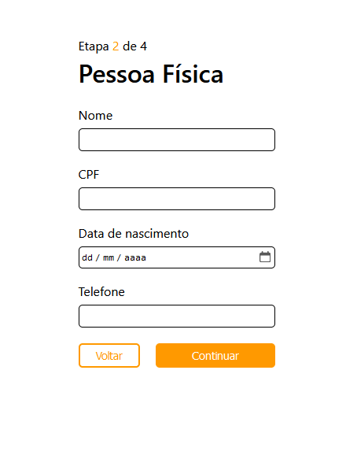

# Registration MB

## Description

This is a project for a legal entity or individual registration form.
It has a data structure used to dynamically build the forms.

## Images

<p float="left">
  
   
  
  
</p>

## Technologies Used

- Vue.js
- Vite
- SCSS
- Node.js
- Express
- Cors

## How to run

The project uses noje.js to work.

Commands to run the projects:

server:

```bash
start-server
```

client:

```bash
build-client
```

both(recommended):

```bash
build-and-serve
```

## Data structure

The data structure is used to assemble the form, it is located in the path: `\src\helpers\formStructure.js`

The const `FORMS_STRUCTURE` is used to create the form `dynamically`.
`FORMS_STRUCTURE` is a list of functions that return an object. It was chosen to be a function because each function receives the data from the previous steps.

```bash
//Structure of the list used to create de form:
export const FORMS_STRUCTURE = [
    //Structure of the object returned by the function:
    (formSubmit) => {
        return {
            title: 'String: title of the form',
            formFields: [
            // formFields is a list of input configurations, each input has its own function.
            {
                type: 'String: type used in inputs types, e.g., text, radio, date, password...',
                id: 'String: unique ID',
                review: 'Boolean: This field is used to determine if the input will be added in the review',
                fieldTitle: 'String: Title of the input to be displayed',
                errors: [
                // errors is a list of validations for the input field, this list follows in increasing index order.
                {
                    message: 'String: Error message to be displayed if the callback function is not satisfied',
                    callback: 'Function: This function receives the field value, returning true if it is INVALID and false if it is VALID',
                }
                ],
                showError: 'String: This field should remain an empty string (""), it is used to display the error in the input',
                value: 'String: Default value of the input, if no value should be added leave it as an empty string ("")',
                options: [
                // options is a list used only for the type: "radio", with all options for each radio.
                {
                    title: 'String: Title of the input to be displayed',
                    value: 'String: input value',
                },
                ],
            },
            ],
        };
  },
]
```
